## 💬 Real-Time Chat Application

A full-stack real-time chat application built using **React.js** and **Node.js** that allows users to communicate instantly through one-to-one messaging. The application supports secure authentication, real-time online status, media sharing, profile management, and multiple theme options including light and dark modes.

## 📖 Project Description

This is a **full-stack real-time chat application** designed to provide fast, secure, and user-friendly communication between users. The frontend is developed using **React.js** with **Tailwind CSS** for responsive UI design, **React Router** for smooth navigation, **Zustand** for global state management, and **Socket.IO client** for real-time messaging.

The backend is powered by **Node.js** and **Express.js**, with **MongoDB (Mongoose)** for database management. Real-time communication is handled using **Socket.IO**, while user authentication and authorization are secured using **JWT** and **bcrypt.js**. Media sharing such as images and videos is supported using **Cloudinary**.

The application includes essential chat features such as user signup, login, logout, profile updates, real-time online user tracking, theme selection (light, dark, and more), and one-to-one messaging with media support. The system is designed with scalability, security, and performance in mind.

## 🛠️ Tech Stack

### Frontend
- React.js
- Tailwind CSS
- React Router
- Zustand (State Management)
- Socket.IO Client

### Backend
- Node.js
- Express.js
- MongoDB & Mongoose
- Socket.IO
- JWT Authentication
- bcrypt.js
- Cloudinary (Image & Video Upload)

## ✨ Features

- User authentication (Sign Up, Login, Logout)
- Real-time one-to-one messaging
- Online users indicator
- Image and video sharing in chat
- User profile update functionality
- Multiple themes (Light, Dark, and more)
- Secure authentication using JWT
- Responsive and modern UI

## 📸 Screenshots

---

## 🌞 Light Theme

### 🔐 Sign In Page
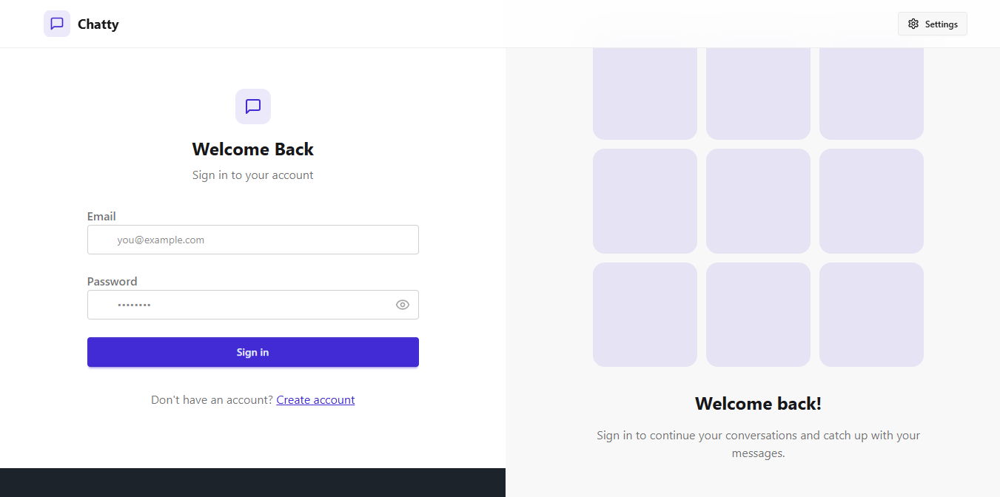

### 📝 Sign Up Page
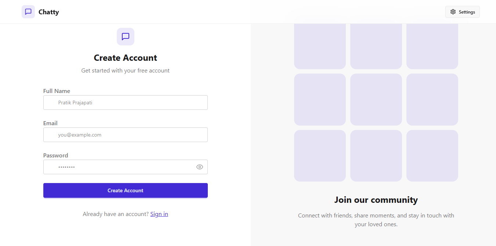

### 🎨 Theme Selection
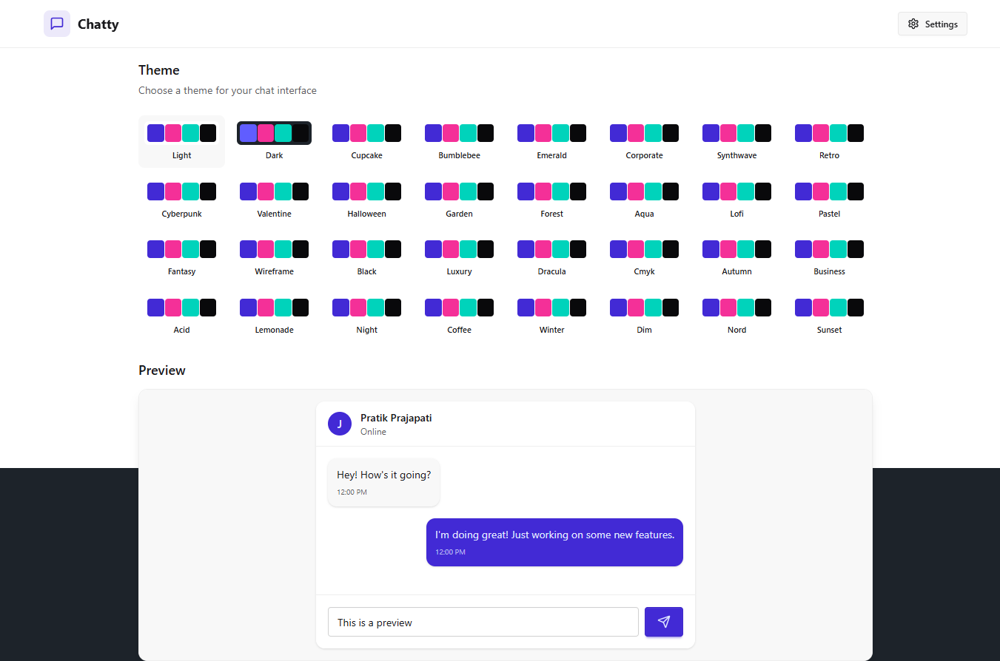

### 💬 Chat Screen
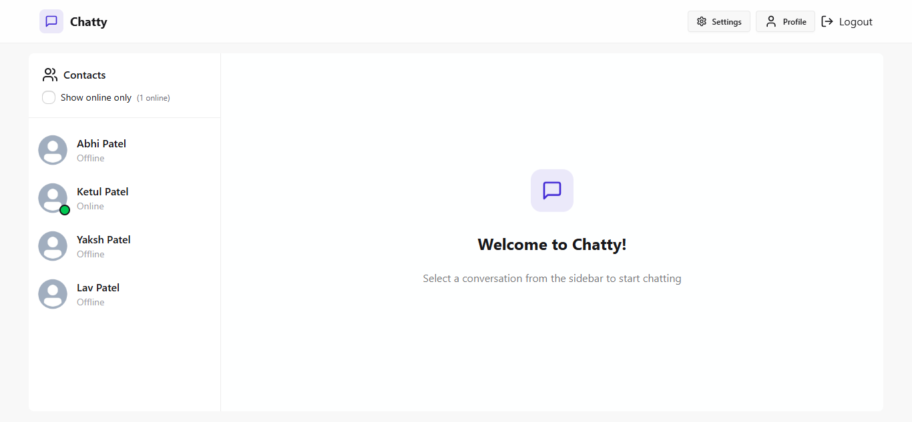
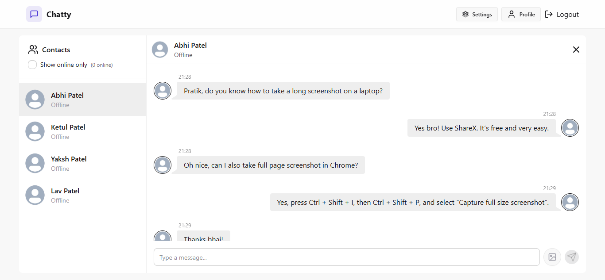
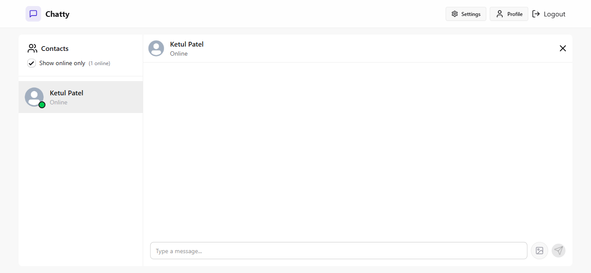

### 👤 Profile Page
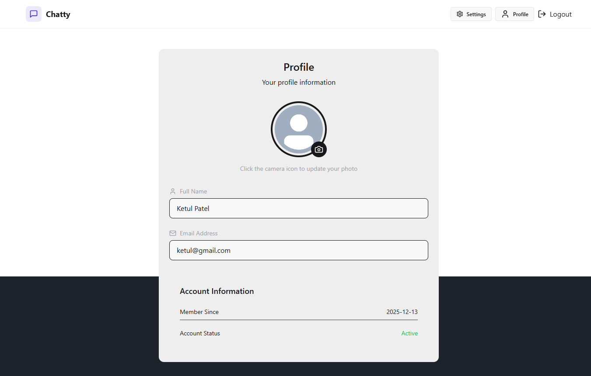

---

## 🌙 Dark Theme

### 🔐 Sign In Page
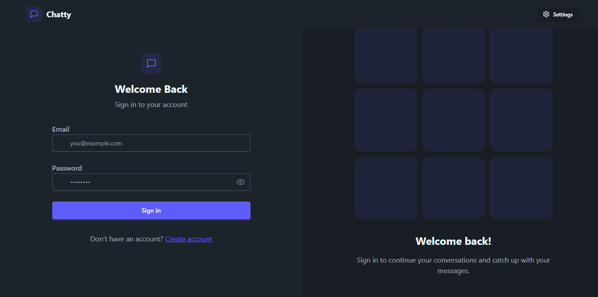

### 📝 Sign Up Page
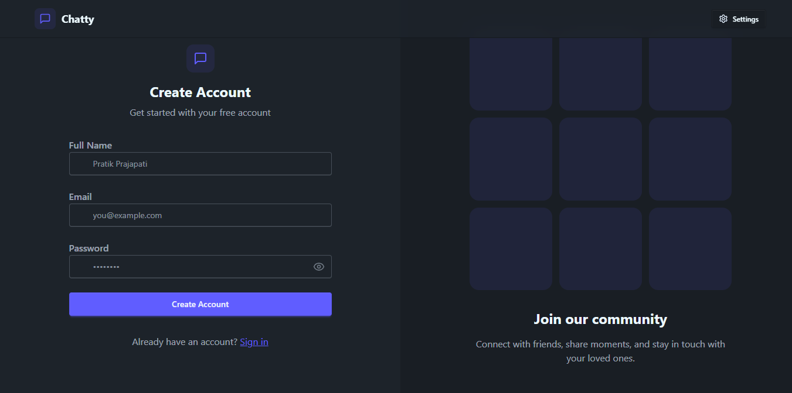

### 🎨 Theme Selection
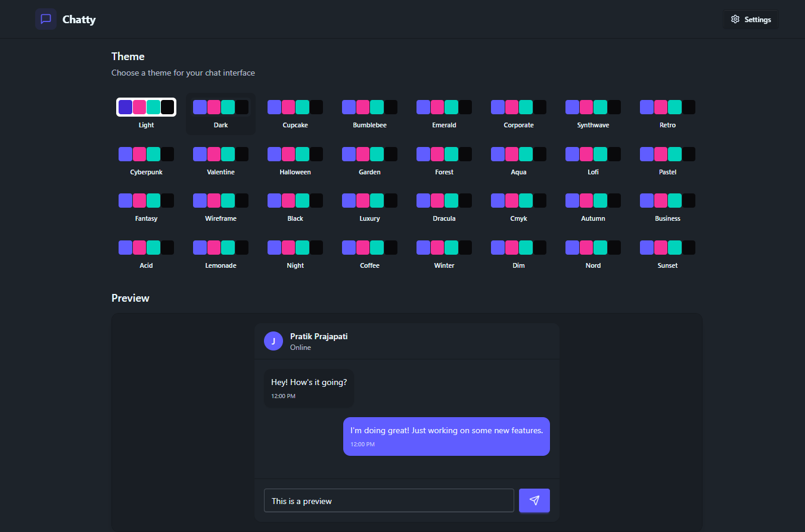

### 💬 Chat Screen

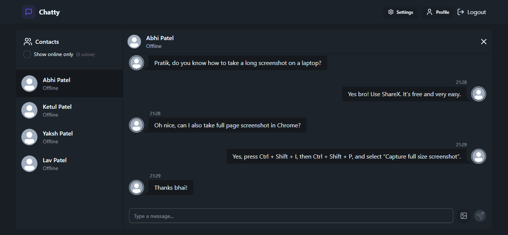
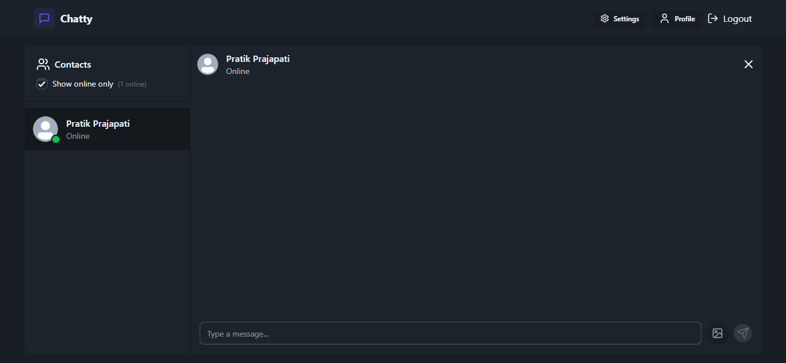
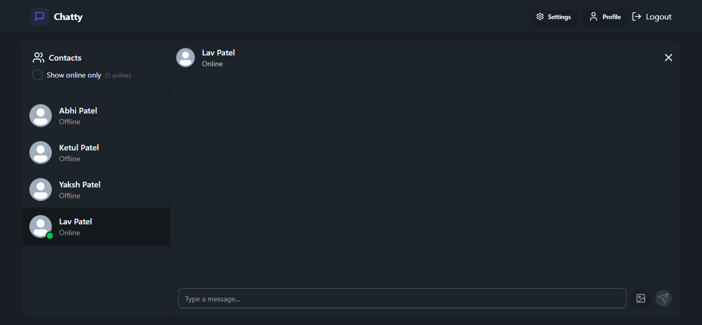
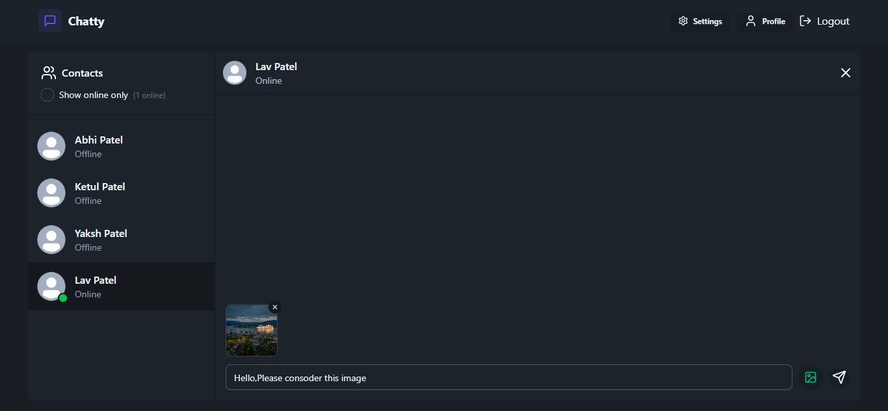

### 👤 Profile Page
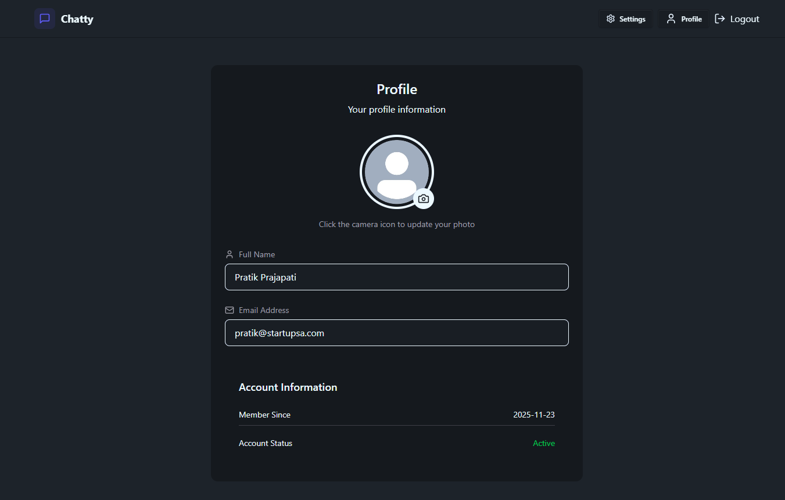
